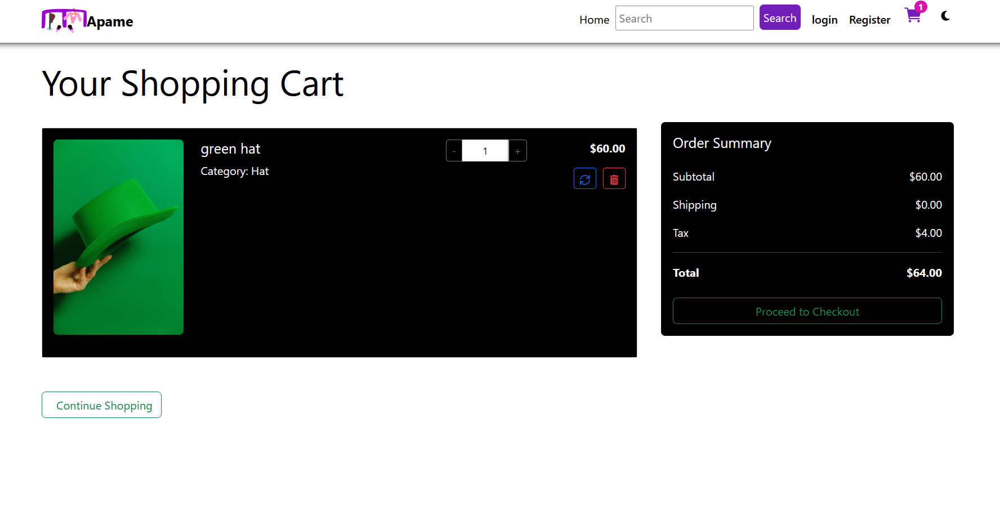

# Apame E-commerce Web App

A full-stack e-commerce web application built with React and a Django REST API backend.  
It includes authentication, cart management, checkout with payment integration, and order tracking.

🌐 Live Demo: https://react-apame.onrender.com

---

## 🚀 Features

### 🛒 Shopping Features
- Browse products and view detailed product pages
- Add/remove items from cart
- Update product quantity in cart
- Real-time cart state management

### 🔍 Product Pages
- Dynamic product detail pages using URL slugs
- Example: `/detail/t-shirt`

### 🔐 Authentication
- User registration and login system
- Token-based authentication (Axios interceptor)
- Protected routes (checkout, profile, cart actions)

### 💳 Checkout & Payment
- Checkout page requires authentication
- Secure payment flow integration
- Payment status handling:
  - Successful payment
  - Cancelled payment
  - Failed payment

### 👤 User Profile
- View user profile
- Update avatar
- View order history

### 📦 Orders
- Automatically create orders after successful payment
- Store purchased items per order

### 🔎 Search
- Product search with keyword matching (first-letter based filtering)

### ❌ 404 Page
- Catch-all route for undefined pages (“Not Found”)

---

## 🧱 Project Structure (Frontend)

- `api.js` → Axios instance (base URL, token handling, CRUD requests)
- `App.jsx` → Main routing configuration
- `MainLayout` → Navbar, footer, and global layout wrapper
- `Protected Routes` → Restrict checkout & profile pages
- Pages:
  - Home
  - Product Detail
  - Cart
  - Login / Register
  - Checkout
  - Profile
  - Payment Status

---

## ⚙️ Tech Stack

- React (Vite)
- React Router
- Axios
- Django REST Framework (Backend)
- JWT Authentication
- Flutterwave Payment Integration

---

## 🔐 Authentication Flow

- User logs in → token saved in localStorage
- Axios automatically attaches token to requests
- Backend validates user for protected endpoints

---

## 💳 Payment Flow

1. User checks out
2. Redirected to payment gateway
3. Returns to `/payment-status`
4. Backend verifies transaction
5. Order is created if successful
6. Cart is cleared

---

## 📌 Notes

- Cart and checkout are protected routes (auth required)
- Payment status page handles success/cancel/failure states
- All API calls go through a centralized `api.js` file

---

## 📷 Live Project

👉 https://react-apame.onrender.com

## 💳 Flutterwave testing card 

 👉 https://developer.flutterwave.com/v3.0/docs/testing 

 ## 📸 My Apame site pictures 

 

 

 